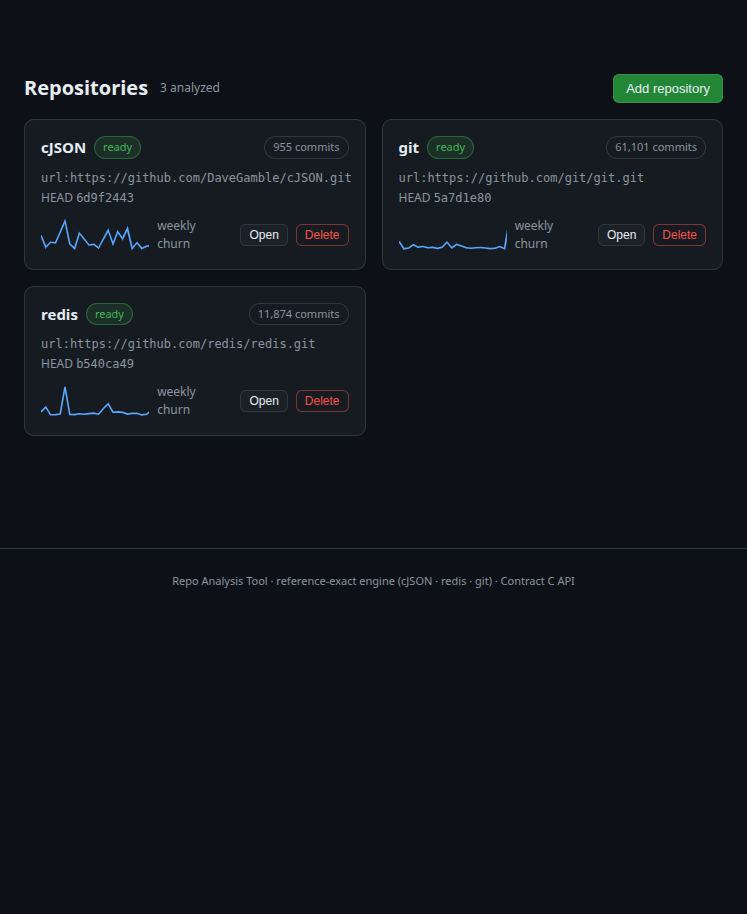
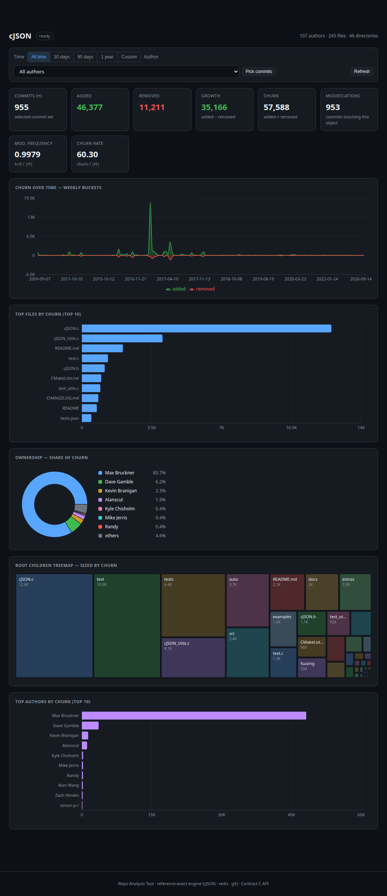
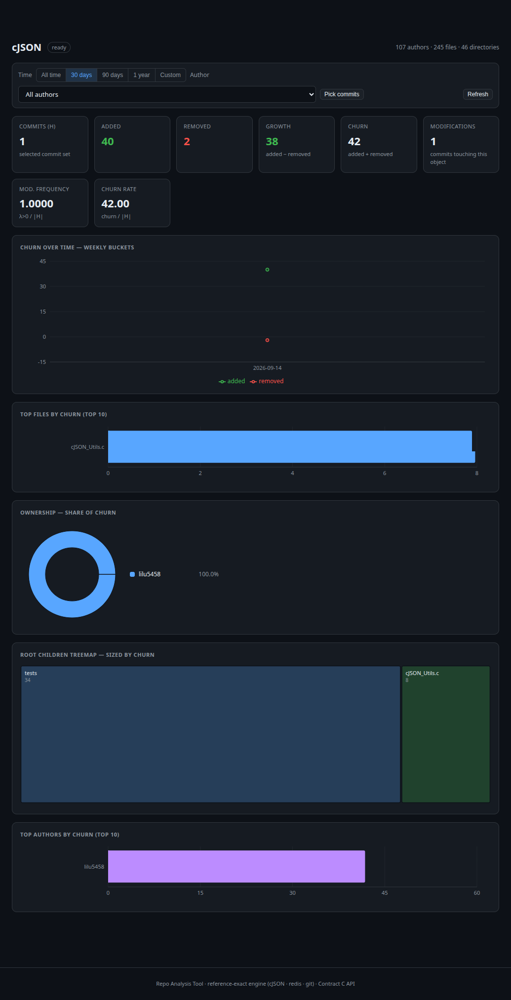
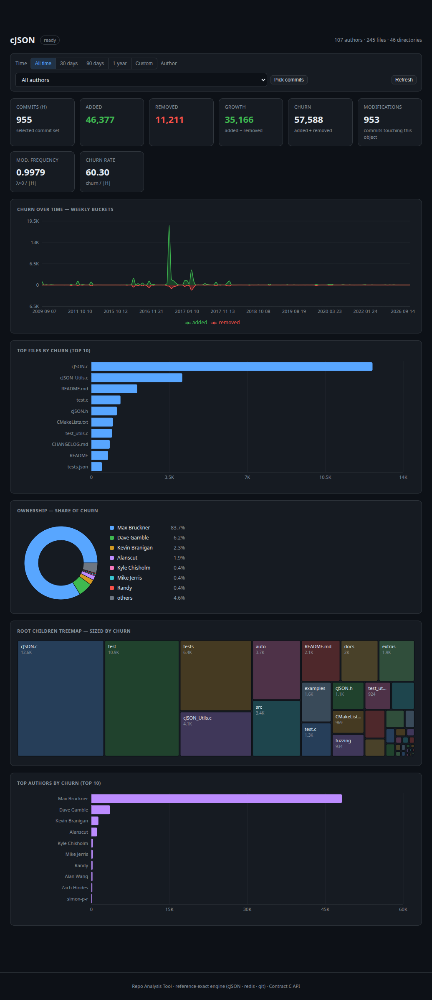
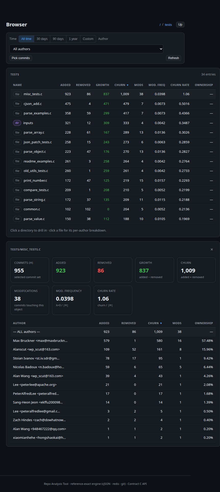
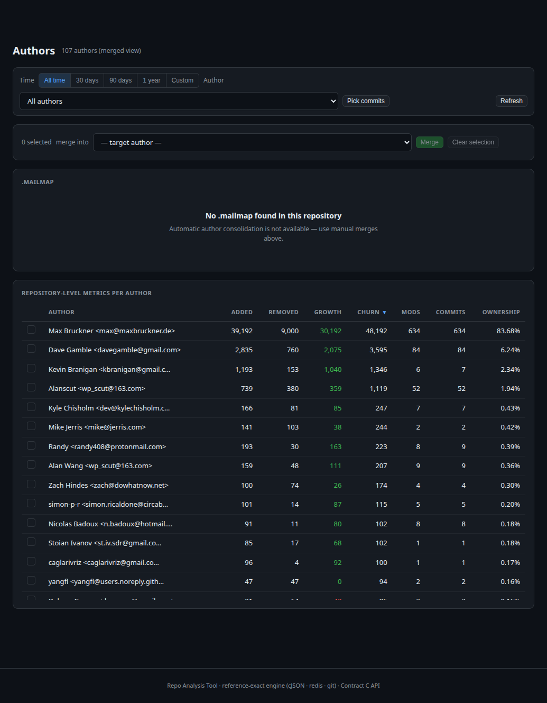
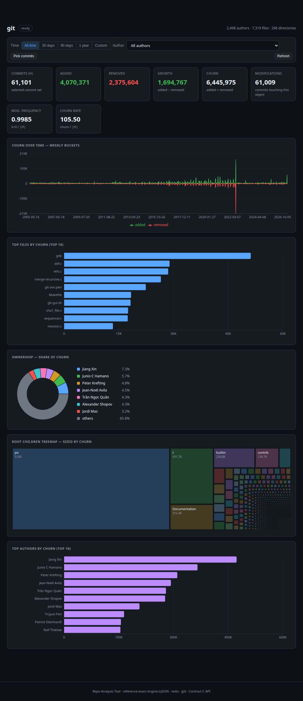
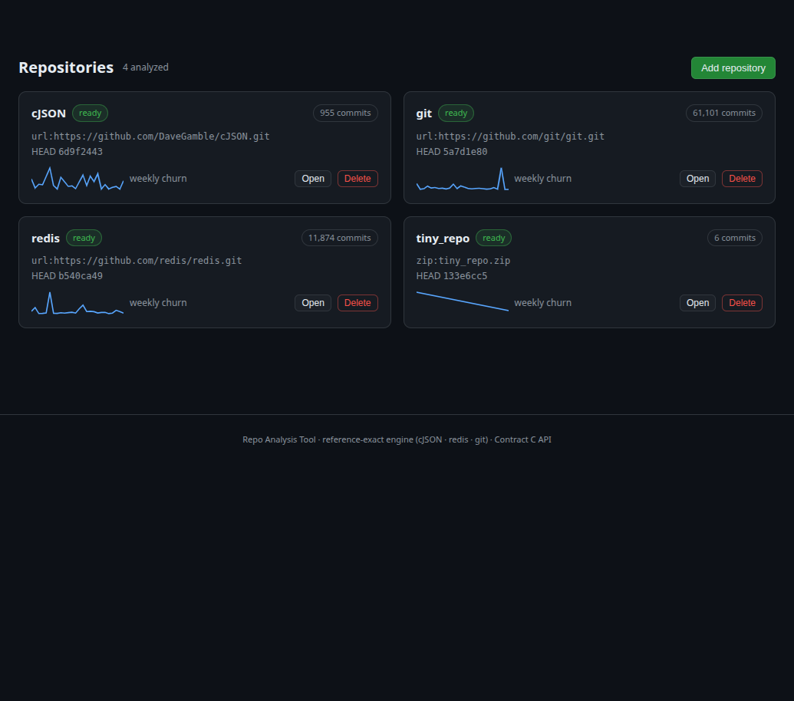
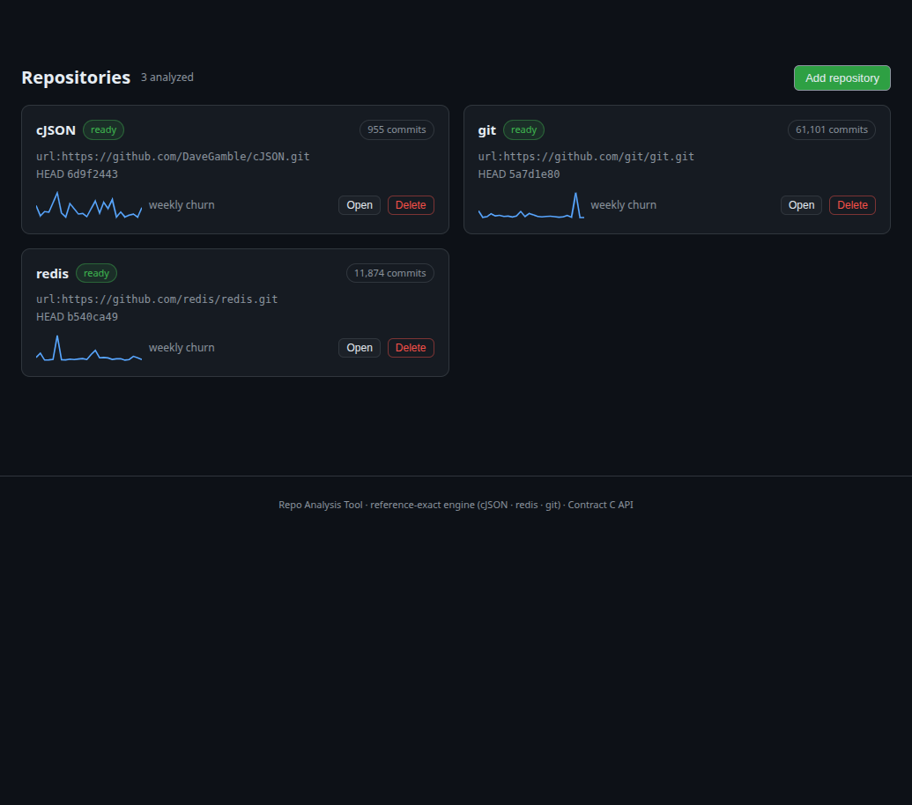
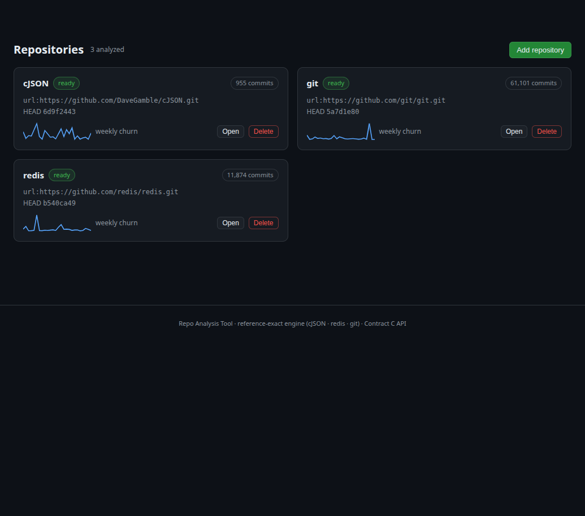

# Repo Analysis Tool (RAT) — COMS3011A Test

A web-app dashboard that measures git repository metrics — **added / removed
lines, growth, churn, modifications, modification frequency, churn rate and
ownership** — per author, per file, per directory and per repository, across
multiple repositories, filtered by time window, author, or a manually selected
commit list, with author merging (manual + `.mailmap`).

The metric engine reproduces the provided reference CSVs for **cJSON, redis and
git byte-exactly** (see *Correctness*), and the full stack (engine → API → UI)
ships with a validation suite that proves it.

## Correctness (grading oracle)

| Repository | Reference CSV | Commits (H̄) | CSV rows | Result |
| --- | --- | ---: | ---: | --- |
| cJSON | `repo-references/cJSON_6d9f2443ab07.csv` | 955 | 983 | **EXACT MATCH** |
| redis | `repo-references/redis_b540ca49cba8.csv` | 11 874 | 18 301 | **EXACT MATCH** |
| git | `repo-references/git_5a7d1e8045ce.csv` | 61 101 | 62 600 | **EXACT MATCH** |

"Exact" means every one of the 15 columns of every row matches and both row sets
are identical (missing = 0, extra = 0, cell mismatches = 0) — the validator
checks all columns, not just the numbers. Reproduce end-to-end with:

```bash
bash scripts/fetch_repos.sh     # deep clones at the pinned SHAs (~650 MB)
bash scripts/sample_data.sh     # engine scan -> data/db/*.sqlite + catalog
bash scripts/verify.sh          # engine vs all 3 references + full test suite
```

Key semantics (frozen in `contracts/ENGINE_OUTPUT.md`): non-merge commits
reachable from the reference (`--no-merges`); `--numstat -z -M50%` rename
detection; **mailmap-canonical authors** (`%aN <%aE>`); binaries (`- -`) are
skipped entirely; nonzero renames attribute to the new path, while **pure 0/0
renames emit all-zero touch markers on both old and new paths**; modification
frequency = commits with λ>0 over |H|; churn rate = Σ(l⁺+l⁻)/|H|; ownership =
author churn share.

## Quick start

```bash
python3 -m venv .venv && .venv/bin/pip install -r backend/requirements.txt
bash scripts/fetch_repos.sh          # one-time: clone the 3 pinned repos
bash scripts/sample_data.sh          # one-time: scan them into data/db/
bash scripts/serve.sh                # builds the UI (first run) and serves
```

Open **http://localhost:8000** — or add your own repository through the UI
(clone URL or zip upload with drag & drop). Interactive API docs: `/docs`.
Hot-reload development: `bash scripts/dev.sh` (FastAPI :8000 + Vite :5173).

No login, no accounts, no API keys: every dependency comes from public PyPI/npm,
`fetch_repos.sh` clones the **public** reference repositories over HTTPS
(anonymous), and the app itself has no authentication. For a fully offline run,
the UI can talk to the bundled fixture API instead (`frontend/README.md`), or
you can upload `fixtures/tiny_repo.zip` through the UI — both need no network
beyond the one-time installs.

## Architecture

```
        ┌─────────────────────────────────────────────────────────────┐
        │  frontend/  Vite + React dashboard (dark theme, recharts)   │
        │  hash-routed views, URL-driven filters, virtualised picker  │
        └──────────────────────────────┬──────────────────────────────┘
                                       │ /api (Contract C)
        ┌──────────────────────────────▼──────────────────────────────┐
        │  backend/app  FastAPI                                       │
        │   ingest: deep clone / zip upload -> background scan        │
        │   store : SQLite per repo (contracts/STORE_SCHEMA.sql)      │
        │   query : metrics / children / series / authors / merges    │
        └──────────────────────────────┬──────────────────────────────┘
                                       │
        ┌──────────────────────────────▼──────────────────────────────┐
        │  backend/rat_engine  (stdlib-only)                          │
        │   git log --numstat -z -M50% -> SQLite -> metric aggregation│
        │   -> CSV export byte-compatible with repo-references/       │
        └─────────────────────────────────────────────────────────────┘
```

## Repository layout

| Path | Purpose |
| --- | --- |
| `contracts/` | Frozen contracts: `ENGINE_OUTPUT.md` (A), `STORE_SCHEMA.sql` (B), `API.md` (C) |
| `backend/rat_engine/` | Metric engine: `scan` (git → SQLite), `export` (SQLite → CSV), metrics computation |
| `backend/app/` | FastAPI app: ingestion, catalog, queries, Contract C endpoints, SPA hosting |
| `frontend/` | Vite + React dashboard (see `frontend/README.md`) |
| `tools/` | `rat_validate.py` (strict CSV differ), `make_fixtures.py`, `bench.py`, `validate_all.sh` |
| `tests/`, `backend/tests/` | 35 tests: engine edge cases, mutation detection, fixtures stability, API |
| `scripts/` | `fetch_repos.sh`, `sample_data.sh`, `serve.sh`, `dev.sh`, `verify.sh` |
| `fixtures/` | Mock API fixtures + deterministic `tiny_repo.zip` demo repo |
| `repo-references/` | The provided reference CSVs (oracle) |
| `docs/` | Workstream briefs, parallel plan, demo guide, screenshots |

## Testing

```bash
.venv/bin/python -m pytest tests backend/tests -q     # 35 passed
```

Highlights: a deterministic edge-case fixture repo (rename detection, unicode
authors/paths, binary skip, deleted-file survival, merge exclusion); a
**mutation-detection proof** (every single-cell mutation of 6 synthetic rows and
150 sampled real cJSON rows must be caught — 100% detected); fixtures
byte-stability; and 20 API tests running against both the mock store and the
real SQLite store (reference totals asserted).

## Performance

Measured with `tools/bench.py` against the pinned git.git checkout (61 101
commits) on an ordinary dev machine — stdlib-only Python, single process, no
parallelism:

| Metric | Result |
| --- | ---: |
| Scan | 61 101 commits in 31.5 s — **1 937 commits/s** |
| Throughput | 138 238 file entries — **4 383 entries/s** |
| Export | 62 600 CSV rows (9.5 MB) in **1.0 s** |
| Full gate | `bash scripts/verify.sh` — 3 × EXACT MATCH + 35 tests, all green |

## Screenshots

All captured in a real browser against the running stack (`bash scripts/serve.sh`).
The walkthrough that produces them is in `docs/demo.md`.

| Repositories | Dashboard — cJSON (reference-exact KPIs) |
| --- | --- |
|  |  |
| Time filter — 30 days | Commit picker — search "heap", 2 selected |
|  |  |
| Browser — directory drill-in + per-author panel | Authors — merge / unmerge / .mailmap |
|  |  |
| Scale — git.git (61 101 commits) | Ingest — zip upload, live scan, ready |
|  |  |
| Add repository — clone URL / zip upload | Two-step delete |
|  |  |

## Workstreams

| Branch | Scope |
| --- | --- |
| `feat/ws1-engine` | Engine (scan/store/export) — reference-exact |
| `feat/ws2-validator` | Validator, mutation tests, fixtures, bench |
| `feat/ws3-api` | FastAPI backend (Contract C) |
| `feat/ws4-ui` | Vite + React dashboard |
| `chore/ws5-infra-docs` | Scripts, README, demo docs, screenshots |

The demo walkthrough and rubric mapping live in `docs/demo.md`.
